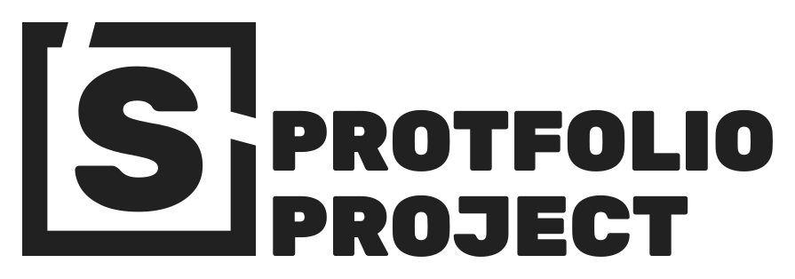

<div id="top"></div>

<div align="left">
  <a href="https://iamstephan.dev">
    
  </a>

<h3 align="left">Portfolio Project</h3>

  <p align="left">
    <a href="https://iamstephan.dev">Visit Website</a>
    •
    <a href="https://github.com/IamStephan/portfolio/issues">Report Bug</a>
  </p>
</div>

<!-- ABOUT THE PROJECT -->

## About The Project

<br />
[![Product Name Screen Shot][product-screenshot]](https://iamstephan.dev)
<br />

With more experience and new projects to showcase, I thought it would make
sense to update my portfolio. Aiming for performance and a somewhat
pleasant-to-look-at design, I used NextJS and TailwindCSS as the base
for this project.

In an attempt to keep performance as good as possible, I designed and
developed most of the components, sections and logic from scratch and
used as few libraries as I could (where it made sense).

There were some interesting challenges while working on this. Most
notably, the handling of MDX content. There are 2 main libraries used
for this (next-remote-mdx and mdx-bundler); both would've been perfect
for what I wanted. I ended up going with next-remote-mdx since it would
allow me to later extract the content if needed. The only problem;
next/image does not work with it unless you deal with it yourself
(and I really wanted to use next/image with blur placeholders).

<p align="right">(<a href="#top">back to top</a>)</p>

### Handling mdx content images

To handle this, I created a token-based system. A simple strategy
to reference images inside mdx files. Simply place this,
`image('path_to_image', 'alt text')`, where the image needs to go
and, depending on where it's used, would insert the appropriate
data ([example file](content/_template/index.mdx)).

Main libraries responsibe for this:

- [mdx-nfi (for frontmatter)](lib/mdx-nfi/index.ts)
- [mdx-nci (for content)](lib/mdx-nci/index.ts)
- [mdx-next-image-props](lib/mdx-next-image-props/index.ts)
- [token-parser](lib/token-parser/index.ts)

<p align="right">(<a href="#top">back to top</a>)</p>

### Built With

- [Next.js](https://nextjs.org/)
- [React.js](https://reactjs.org/)
- [Typescript](https://www.typescriptlang.org/)
- [TailwindCSS](https://tailwindcss.com/)

<p align="right">(<a href="#top">back to top</a>)</p>

## Run Locally

Clone the project

```bash
  git clone https://github.com/IamStephan/portfolio project-name
```

Go to the project directory

```bash
  cd project-name
```

Install dependencies

```bash
  # Using npm
  npm install

  # Using yarn
  yarn
```

Start dev server

```bash
  # Using npm
  npm run dev

  # Using yarn
  yarn dev
```

Build the project

```bash
  # Using npm
  npm run build

  # Using yarn
  yarn build
```

Start server after project build

```bash
  # Using npm
  npm run start

  # Using yarn
  yarn start
```

<p align="right">(<a href="#top">back to top</a>)</p>

## Related

Previous iterations of this project.

- [portfolio-v1](https://github.com/IamStephan/portfolio-v1)

<p align="right">(<a href="#top">back to top</a>)</p>

[product-screenshot]: assets/showcase_homepage.webp
