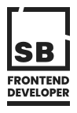

<div id="top"></div>

<div align="center">
  <a href="https://github.com/github_username/repo_name">
    
  </a>

<h3 align="center">Portfolio Project</h3>

  <p align="center">
    project_description
    <br />
    <a href="https://github.com/github_username/repo_name">View Demo</a>
    ·
    <a href="https://github.com/github_username/repo_name/issues">Report Bug</a>
    ·
    <a href="https://github.com/github_username/repo_name/issues">Request Feature</a>
  </p>
</div>

<!-- ABOUT THE PROJECT -->

## About The Project

[![Product Name Screen Shot][product-screenshot]](https://example.com)

Here's a blank template to get started: To avoid retyping too much info. Do a search and replace with your text editor for the following: `github_username`, `repo_name`, `twitter_handle`, `linkedin_username`, `email`, `email_client`, `project_title`, `project_description`

<p align="right">(<a href="#top">back to top</a>)</p>

### Built With

- [Next.js](https://nextjs.org/)
- [React.js](https://reactjs.org/)
- [Vue.js](https://vuejs.org/)
- [Angular](https://angular.io/)
- [Svelte](https://svelte.dev/)
- [Laravel](https://laravel.com)
- [Bootstrap](https://getbootstrap.com)
- [JQuery](https://jquery.com)

<p align="right">(<a href="#top">back to top</a>)</p>

<!-- USAGE EXAMPLES -->

## Run Locally

### Prerequisites

This is an example of how to list things you need to use the software and how to install them.

npm

```sh
  npm install npm@latest -g
```

### Usage

Clone the project

```bash
  git clone https://link-to-project
```

Go to the project directory

```bash
  cd my-project
```

Install dependencies

```bash
  npm install
```

Start the server

```bash
  npm run start
```

<p align="right">(<a href="#top">back to top</a>)</p>

## Contact

Your Name - [@twitter_handle](https://twitter.com/twitter_handle) - email@email_client.com

Project Link: [https://github.com/github_username/repo_name](https://github.com/github_username/repo_name)

<p align="right">(<a href="#top">back to top</a>)</p>

## Related

Previous iterations of this project.

- [portfolio-v1](https://github.com/matiassingers/awesome-readme)

<p align="right">(<a href="#top">back to top</a>)</p>
